# Developer Guide

- [**Developer Guide**](#developer-guide)
  - [Introduction](#introduction)
  - [**Setting up and getting started**](#setting-up-and-getting-started)
    - [Prerequisites](#prerequisites)
    - [Setting up the project in your computer](#setting-up-the-project-in-your-computer)
  - [**Design & implementation**](#design--implementation)
    - [Architecture](#architecture)
    - [UI component](#ui-component)
    - [Parser component](#parser-component)
    - [TaskList component](#tasklist-component)
    - [Storage component](#storage-component)
    - [TimeAllocator component](#timeallocator-component)
    - [Timetable component](#timetable-component)
  - [**Implementation**](#implementation)
    - [Data storage](#data-storage)
    - [User Command Processing](#user-command-processing)
    - [Add task feature](#add-task-feature)
    - [Edit task feature](#edit-task-feature)
    - [List feature](#list-feature)
    - [Mark task as done feature](#mark-task-as-done-feature)
    - [Delete task feature](#delete-task-feature)
    - [View task feature](#view-task-feature)
    - [Time allocation to task in timetable](#time-allocation-to-task-in-timetable)
  - [**Appendix: Instructions for manual testing**](#appendix-instructions-for-manual-testing)
    - [Launch and shutdown](#launch-and-shutdown)
    - [Adding a task](#adding-a-task)
    - [Editing a task](#editing-a-task)
    - [Listing all tasks](#listing-all-tasks)
    - [Marking a task as done](#marking-a-task-as-done)
    - [Deleting a task](#deleting-a-task)
    - [Viewing the full details of a task](#viewing-the-full-details-of-a-task)
    - [Help](#help)
    - [Data storage](#data-storage)
  - [**Appendix: Requirements**](#appendix-requirements)
  - [**Product scope**](#product-scope)
    - [Target user profile](#target-user-profile)
    - [Value proposition](#value-proposition)
    - [User Stories](#user-stories)
    - [Non-Functional Requirements](#non-functional-requirements)
  - [**Other Guides: Documentation, logging, testing, configuration, dev-ops**](#other-guides-documentation-logging-testing-configuration-dev-ops)
  - [**Glossary**](#glossary)
    
## Introduction

Welcome to ATHENA's Developer Guide! ATHENA (which stands for Automated Timetable Helper Encourager n' Assistant), is a desktop daily life planner that aims to help students automate the process of organising their schedule. It is a Command Line Interface (CLI) based application that helps users figure out the best timetable after the user has input their pre-allocated time slots for work and relaxation.

This document describes the software architecture and design of ATHENA that should hopefully help you - a developer, designer, or software tester - understand  the inner workings of ATHENA. 

Do refer to the [glossary](#glossary) if you encounter any unfamiliar terms used in this document.

## Setting up and getting started

### Prerequisites
1. Ensure you have `JDK 11` installed on your computer.
2. Install IntelliJ IDEA (referred to as IntelliJ in the rest of this document).

### Setting up the project in your computer
1. Fork [this](https://https://github.com/AY2021S1-CS2113T-W12-2/tp) repository, and clone the fork onto your computer.
2. Open IntelliJ (If you do not see the welcome screen, click `File` > `Close Project` to close the existing project dialog first).
3. Set up the correct JDK version for Gradle  
   1. Click `Configure` > `Project Defaults` > `Project Structure`.
   2. Click `New…` and select the directory where you have installed `JDK 11`.
   3. Click `OK`.
4. By default, IntelliJ has the Gradle plugin installed. If you have disabled it, go to `File` > `Settings` > `Plugins` to re-enable it.
5. Click `Import Project`(or `Open or Import` in newer versions of IntelliJ).
6. Locate the `build.gradle` file and select it. Click `OK`. If prompted, choose to `Open as Project` (not `Open as File`).
7. Click `OK` to accept the default settings, if prompted. 
8. Wait for the importing process to finish, then you are good to go!
9. Verify the setup:
    1. Run `Athena` and try a few commands such as `list` or `help`.
    2. Run the JUnit tests to ensure they all pass.

## **Design & implementation**

### Architecture

The ***Architecture Diagram*** shown above displays the high-level design of ATHENA. It is done with an N-tier architectural style, where the higher layers make use of services provided by lower layers. A quick overview of each component is shown below.

[`Athena`](https://github.com/AY2021S1-CS2113T-W12-2/tp/blob/master/src/main/java/athena/Athena.java) is responsible for:
* At application launch: Initializes the components and connects them up with each other.
* At application shut down: Shuts down the components.

The rest of the application mainly consists of these components:

* [**`Ui`**](#athenaUi-component): The user interface of ATHENA.
* [**`Parser`**](#parser-component): The component that parses user input and executes commands.
* [**`TaskList`**](#tasklist-component): The list storing all the user's tasks.
* [**`Storage`**](#storage-component): The component that reads data from, and writes data to, the hard disk.
* [**`TimeAllocator`**](#timeallocator-component): The component that allocates tasks without a specified time to a free time slot.
* [**`Timetable`**](#timetable-component): The component to generate an output for the *list* command.

The sections below provide more details for each component.

### UI component

[`Ui.java`](https://github.com/AY2021S1-CS2113T-W12-2/tp/blob/master/src/main/java/athena/Ui.java)

1. `Ui` consists of `AthenaUi` and `ColorText`.
2. `AthenaUi` implements the `Ui` interface and outputs messages that the user sees.
3. `ColorText` applies relevant colors to certain output messages.
4. `AthenaUi` also prints out error messages tied to `CommandException`s that get thrown by `Command`s in `Athena`.
5. `LogicManager` requires `AthenaUi` to execute user commands.

### Parser component

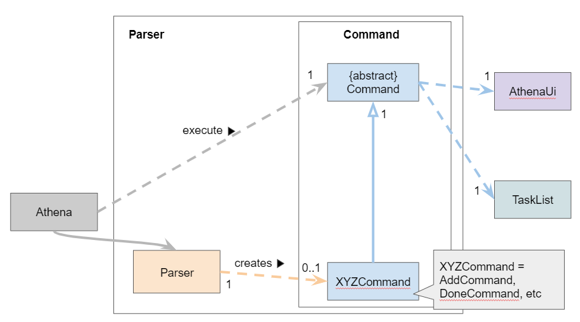

[`Parser.java`](https://github.com/AY2021S1-CS2113T-W12-2/tp/blob/master/src/main/java/athena/Parser.java)

1. `Parser` class will parse the user command.
2. A `Command` object is then created, which is executed by `Athena`.
3. The command execution can alter the `TaskList` (e.g. Adding a task).
4. At the end of each command execution, a corresponding method in `AthenaUi` is called to print a message to the user.

The following sequence diagram illustrates how the `Parser` works:

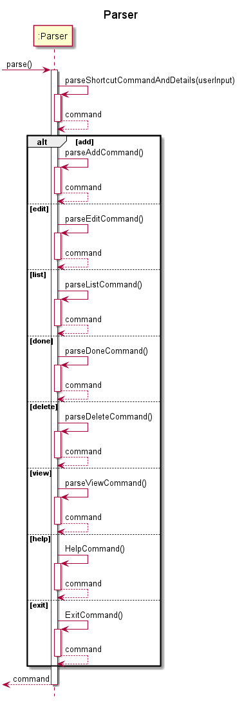

The respective Command sequence diagrams are illustrated [here](#implementation) under the Implementation section of this document.

### TaskList component

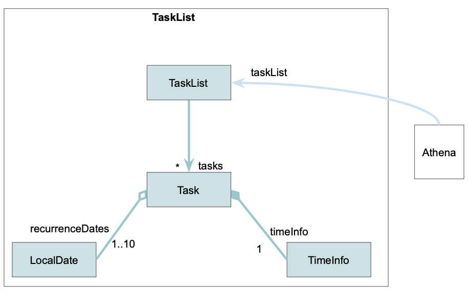

[`TaskList.java`](https://github.com/AY2021S1-CS2113T-W12-2/tp/blob/master/src/main/java/athena/TaskList.java)

1. The `TaskList` stores task data in `Task` type objects.
2. The `TaskList` is updated in `Athena`.
3. A new `Task` object is created everytime the user uses the *add* command.
4. The `Task` object is removed with the *delete* command.

### Timetable component

[`Timetable.java`](https://github.com/AY2021S1-CS2113T-W12-2/tp/blob/master/src/main/java/athena/timetable/Timetable.java)

The `Timetable` component is used to generate an output for the *list* command, when the user requests for Athena to print out the existing tasks. It groups the tasks by their dates and draws an ASCII art timetable for the user.

1. The `ListCommand` creates a `Timetable` to generate an output when the user enters the *list* command.
2. The `Timetable` uses the specified `Importance` and `Forecast` to filter the tasks in the `TaskList`. It also stores the `Forecast` for later use.
3. The `Timetable` groups the tasks by their `LocalDate` in a `TimetableDay`.
4. The `Timetable` also creates a `TimetableDrawer` that is used to generate the timetable ASCII art.
5. The `Timetable` and `TimetableDrawer` store a `TreeMap<LocalDate, TimetableDay>` to query for a `TimetableDay` based on a specific `LocalDate` quickly.

## **Implementation**

This section describes some important details about how certain features are implemented.

### User command processing
The processing of user commands is facilitated by `AthenaUi`, Parser` and the `Command` subclasses.

The following operations are implemented:

* `AthenaUi#detectInput` - Read user input from the standard input stream.
* `Parser#parse` - Split the user's input based on the command type and the various parameters given. The parameters can be entered in any order. A `Command` object based on the type of command entered is returned. 

    The following table shows each command with their corresponding `Command` subclass.

    Command Type | `Command` Subclass
    ---|----
    add | `AddCommand`
    edit | `EditCommand`
    list | `ListCommand`
    done | `DoneCommand`
    delete | `DeleteCommand`
    view | `ViewCommand`
    help | `HelpCommand`
    exit | `ExitCommand`

**Step 1.**  The user input will be read in by the `AthenaUi` class. `Athena` will call for `Parser#parse` to parse the user input and retrieve the respective command type and parameters.

**Step 2.** `Parser#parse` will then create a `Command` object based on the user input. The `Command` object is returned to `Athena`.

**Step 3.** `Athena` will call `Command#execute` to execute the command.

The specific implementation of each command is explained in the following subsections. 

### Add task feature
The mechanism to add a task is facilitated by the `AddCommand` class. The user is able to add a task with the `add` command.

`AddCommand#execute` is called and the `Task` described by the user input is added to the `TaskList`.

`AddCommand` and `TaskList` implements the following operations:

* `AddCommand#execute` - Adds the specified task into `TaskList` and calls `AthenaUi` to print a message to the output.
* `TaskList#addTask` - Creates a task based on the given parameters and adds it into the list.

The process starts with `Parser#parse` parsing the user input and returns an `AddCommand` object. This is described in the [**user command processing**](#user-command-processing) section.

Given below is an example usage scenario and how the task adding mechanism behaves at each step.

**Step 1.** The user launches the application for the first time. The `TaskList` is initialized to be empty.

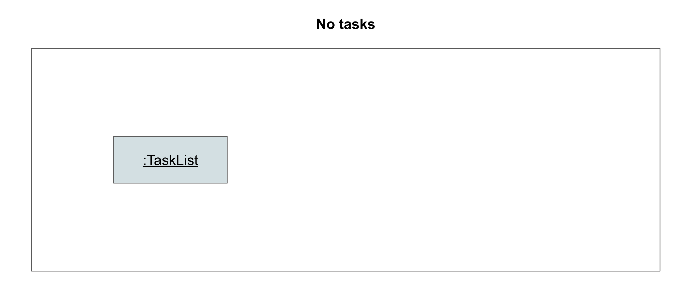

**Step 2.** The user adds a task to the application, by entering `add n/Assignment1 t/1100 D/16-11-2020 d/2 r/Today i/high a/Refer to lecture notes`. `Parser#parse` parses the user input, and creates an `AddCommand` object. The `AddCommand` object is returned to `Athena`.

**Step 3.** `Athena` calls `AddCommand#execute`, which calls `TaskList#addTask` to create a task based on the given parameters, and adds the task to the list. The `TaskList` now contains 1 task (Assignment1).

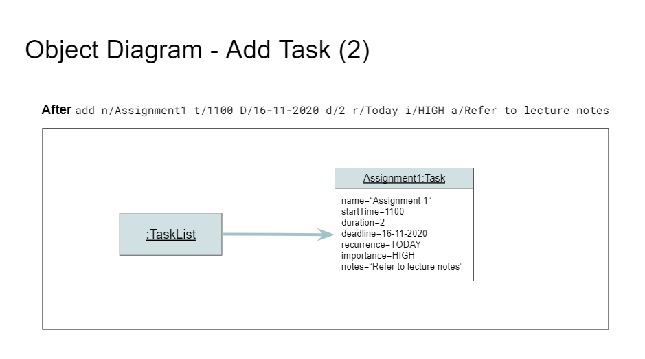

**Step 4.** `AthenaUi` prints a message to inform the user of whether the command has succeeded or failed.

The following sequence diagram illustrates how **Step 3** of the task adding operation works:

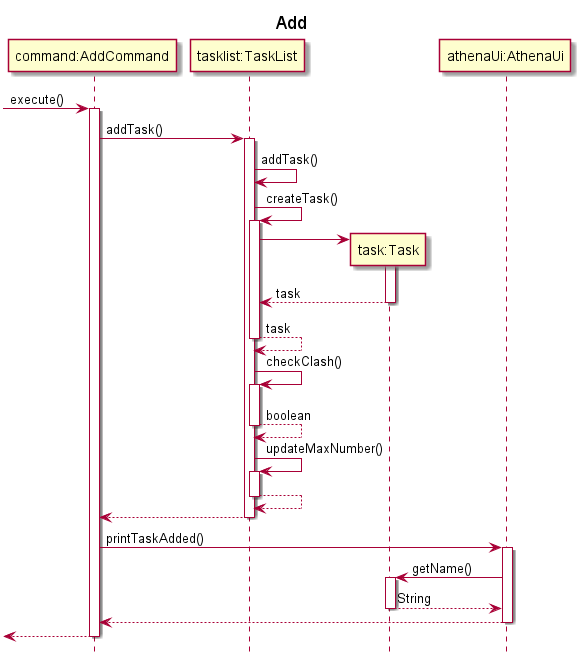

### Edit task feature
The mechanism to edit a task is facilitated by the `EditCommand` class. The user is able to edit a task with the `edit` command.

`EditCommand#execute` is called and the `Task` described by the user input is edited in the `TaskList`.

`EditCommand`, `TaskList` implements the following operations:

* `EditCommand#execute` -  Edits the specified task in `TaskList` and calls `AthenaUi` to print a message to the output.
* `TaskList#editTask` - Edits a task based on the given parameters and adds the updated task into the list.

The process starts with `Parser#parse` parsing the user input and returns an `EditCommand` object. This is described in the [**user command processing**](#user-command-processing) section.

Given below is an example usage scenario and how the task editing mechanism behaves at each step.

**Step 1.** The user launches the application. The `TaskList` contains at least one `Task`.

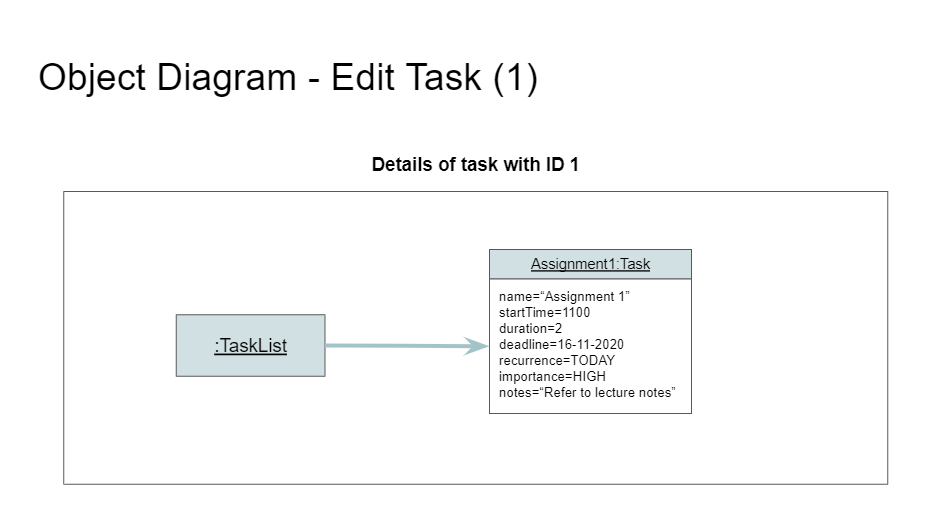 

**Step 2.** The user edits a task to the application, by inputting `edit 1 t/1200`. `Parser#parse` parses the user input, and creates an `EditCommand` object. The `EditCommand` object is returned to `Athena`.

**Step 3.** `Athena` calls `EditCommand#execute`, which calls `TaskList#editTask` to edit the specified task based on the given parameters. The `TaskList` now has the start time of task with index 1 changed from "1100" to "1200". 

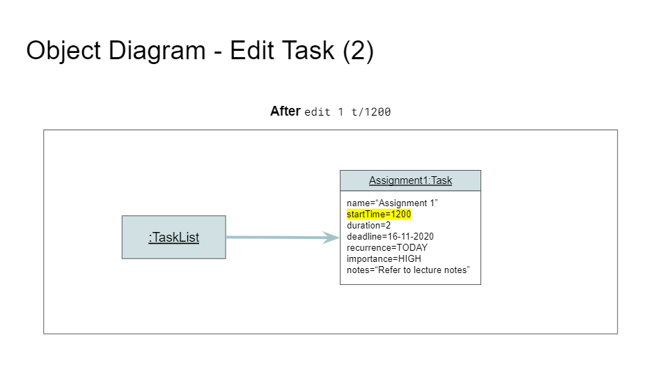 

**Step 4.** `AthenaUi` prints a message to inform the user of whether the command has succeeded or failed. 

The following sequence diagram illustrates how **Step 3** of the editing task operation works:

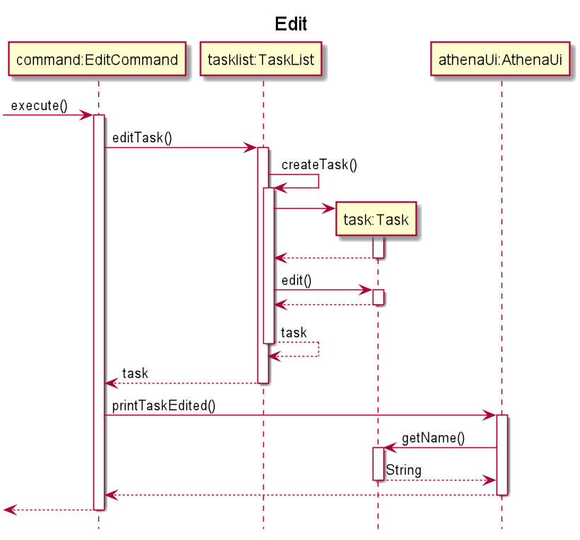

### List feature
The mechanism to print out the user's tasks is facilitated by the `ListCommand` class. The user is able to see a list of their tasks with the `list` command, and can provide filters to display the tasks based on their `Importance` and `Time`.

`ListCommand#execute` is called, and a `Timetable`is used to group the user's tasks by their dates before printing them out.

`ListCommand` and `Timetable` implements the following operations:

* `ListCommand#execute` - Passes the given filters to `Timetable`.
* `Timetable#populateTimetable` - Groups the tasks by their dates in a `TimetableDay`.
* `Timetable#toString` - Prepares a string with a ASCII art timetable and a list of the user's tasks, so that it can be printed to the user.

The process starts with `Parser#parse` parsing the user input and returning a `ListCommand` object. This is described in the [**user command processing**](#user-command-processing) section.

Given below is an example usage scenario and how this mechanism behaves at each step.

**Step 1.** The user launches the application. The `TaskList` contains the `Task`s for the week.

**Step 2.** The user wants to see the `HIGH` `IMPORTANCE` tasks within one week from now, by entering `list i/HIGH f/WEEK`. `Parser#parse` parses the user input, and creates a `ListCommand` object. The `ListCommand` object is returned to `Athena`.

**Step 3.** `Athena` calls `ListCommand#execute`, which creates a `Timetable` with the `TaskList` and the filter values provided by the user. `Timetable` calls `Timetable#populateTimetable` to groups

**Step 4.** `AthenaUi` prints the output generated by `Timetable#toString`.

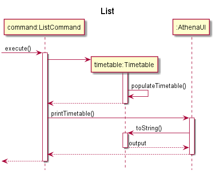

### Mark task as done feature
The mechanism to mark a task as done is facilitated by the `DoneCommand` class. The user can use this feature through the `done` command.

`DoneCommand#execute` is called and the `Task` selected by the user is marked as done by the `TaskList`.

`DoneCommand` and `TaskList` implements the following operations:

* `DoneCommand#execute` - Passes the task number of the corresponding task to `TaskList` to mark the task as done, then calls `AthenaUi` to print a message to the output.
* `TaskList#markTaskAsDone` - Searches for the task with the given number, and marks it as done.

The process starts with `Parser#parse` parsing the user input and returning a `DoneCommand` object. This is described in the [**user command processing**](#user-command-processing) section.

Given below is an example usage scenario and how this mechanism behaves at each step.

**Step 1.** The user launches the application. The `TaskList` contains at least one `Task`.

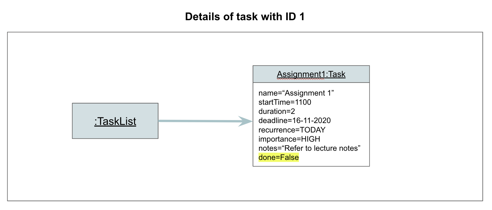

**Step 2.** The user marks **Task 1** as done, by entering `done 1`. `Parser#parse` parses the user input, and creates a `DoneCommand` object. The `DoneCommand` object is returned to `Athena`.

**Step 3.** `Athena` calls `DoneCommand#execute`, which calls `TaskList#markTaskAsDone` to mark **Task 1** as done. **Task 1** is now marked as done.

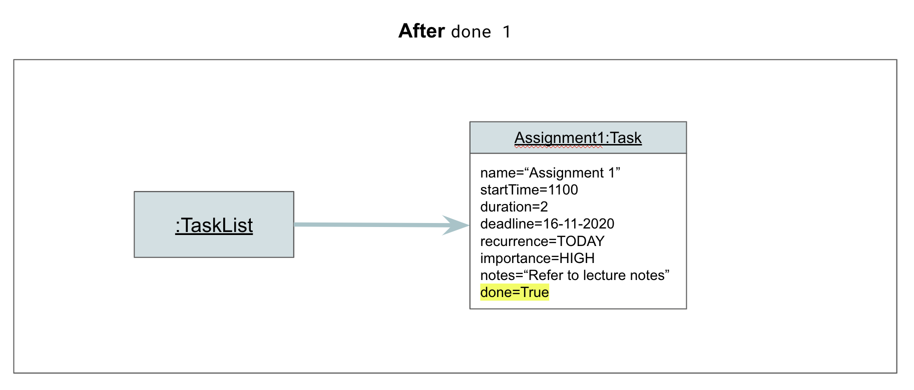

**Step 4.** `AthenaUi` prints a message to inform the user of whether the command has succeeded or failed.

The following sequence diagram illustrates how **Step 3** of the marking task as done operation works:

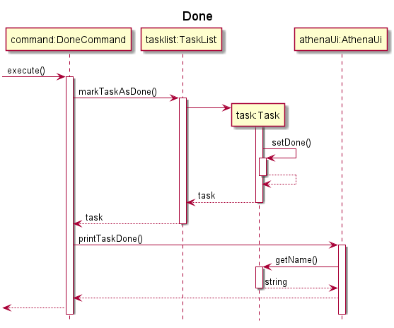

### Delete task feature
The mechanism to delete a task is facilitated by the `DeleteCommand` class. The user is able to delete a task with the `delete` command.

`DeleteCommand#execute` is called and the `Task` selected by the user is deleted from the `TaskList`.

`DeleteCommand` and `TaskList` implements the following operations:

* `DeleteCommand#execute` - Passes the task number of the corresponding task to `TaskList` to delete the task, then calls `AthenaUi` to print a message to the output.
* `TaskList#deleteTask` - Searches for the task with the given task number, then deletes it.

The process starts with `Parser#parse` parsing the user input and returning a `DeleteCommand` object. This is described in the [*User command processing*](#user-command-processing) section.

Given below is an example usage scenario and how this mechanism behaves at each step.

**Step 1.** The user launches the application. The `TaskList` contains at least one `Task`.

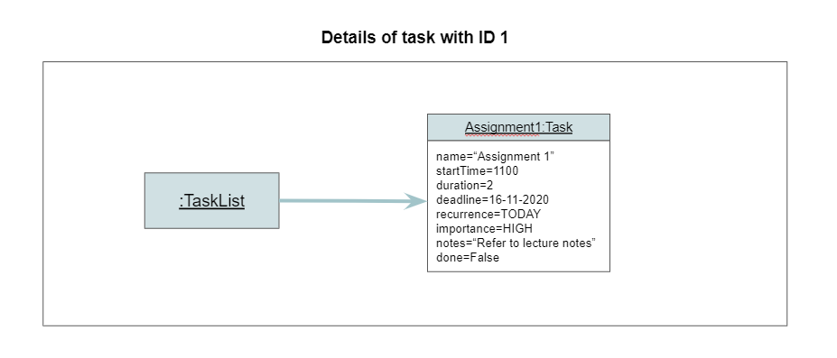

**Step 2.** The user deletes **Task 1** by entering `delete 1`. `Parser#parse` parses the user input, and creates a `DeleteCommand` object. The `DeleteCommand` object is returned to `Athena`.

**Step 3.** `Athena` calls `DeleteCommand#execute`, which calls `TaskList#deleteTask` to delete **Task 1**. **Task 1** is now deleted.

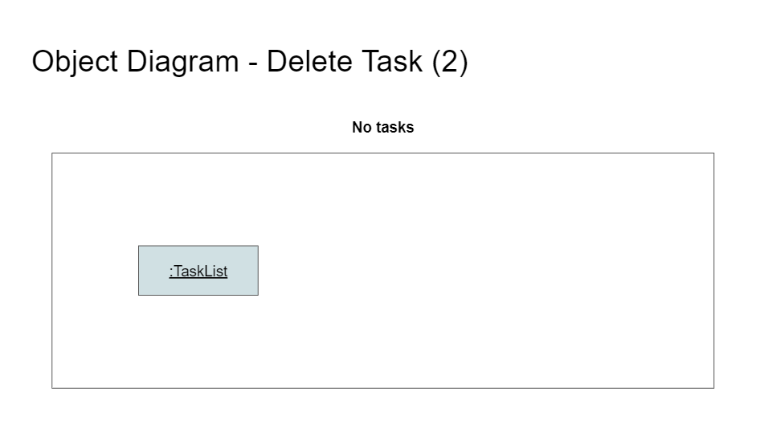

**Step 4.** `AthenaUi` prints a message to inform the user of whether the command has succeeded or failed.

The following sequence diagram illustrates how **Step 3** of the task deleting operation works:

### View task feature
The mechanism to view a task is facilitated by the `ViewCommand` class. The user is able to view a task with the `view` command.

`ViewCommand#execute` is called and the details of the `Task` selected by the user are displayed by the `TaskList`.

`ViewCommand` and `TaskList` implement the following operations:

* `ViewCommand#execute` - Passes the selected task number to `TaskList` of that task that is to be viewed, then calls `AthenaUi` to print a message to the output.
* `TaskList#getTaskDescription` - Searches for the task with the given number, and return the details of the task.

The process starts with `Parser#parse` parsing the user input and returning a `ViewCommand` object. This is described in the [*User command processing*](#user-command-processing) section.

Given below is an example usage scenario and how this mechanism behaves at each step.

**Step 1.** The user launches the application. The `TaskList` contains at least one `Task`.

**Step 2.** The user views **Task 1** by entering `view 1`. `Parser#parse` parses the user input, and creates a `ViewCommand` object. The `ViewCommand` object is returned to `Athena`.

**Step 3.** `Athena` calls `ViewCommand#execute`, which calls `TaskList` to view **Task 1**. The details of **Task 1** can now be viewed.

**Step 4.** `AthenaUi` prints a message to inform the user of whether the command has succeeded or failed.

The following sequence diagram illustrates how **Step 3** of the task viewing operation works:

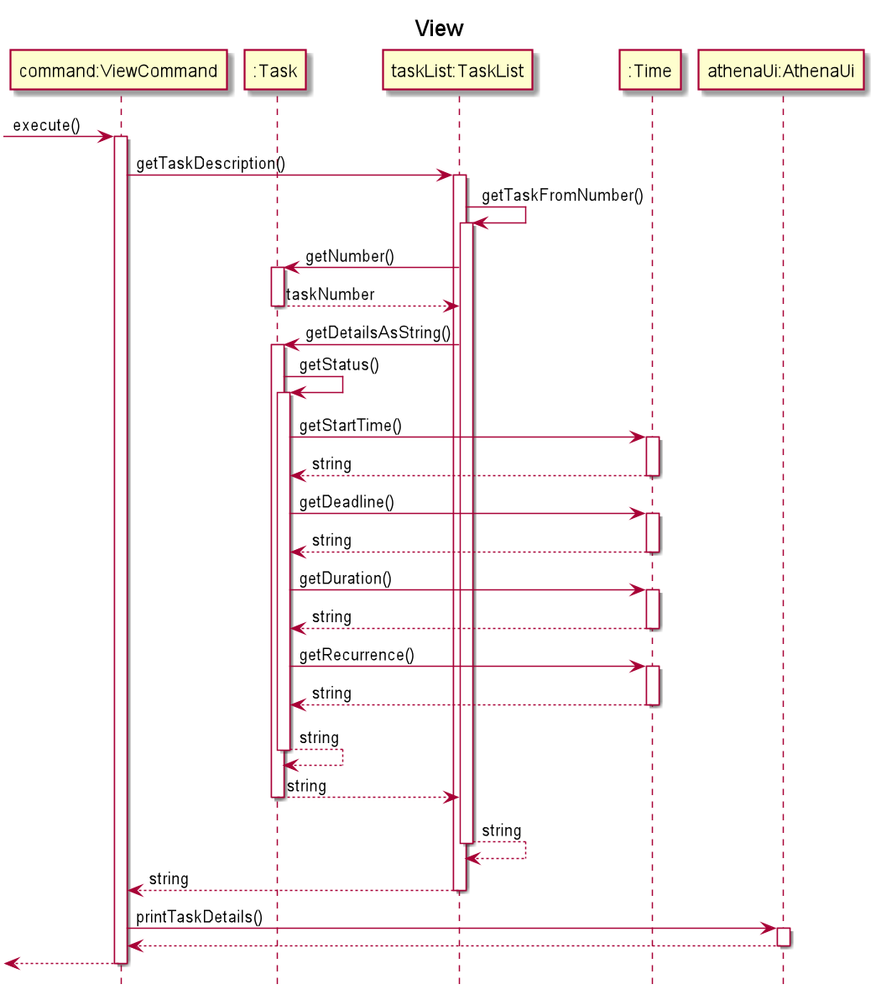

--------------------------------------------------------------------------------------------------------------------

## Appendix: Instructions for manual testing

Given below are instructions to test the app manually.

#### Launch and shutdown

1. Initial launch

    1. Ensure that you have **Java 11** or above installed.
    2. Download the latest version of **ATHENA** [here](https://github.com/AY2021S1-CS2113T-W12-2/tp/releases).
    3. Copy the downloaded Athena.jar into your **Desktop**.
    4. Open the terminal/command prompt and enter `cd Desktop`.
    5. Then, enter `java -jar Athena.jar`.
    
        **Expected:** Shows the command line interface with welcome message.

2. Shutdown ATHENA

   1. Enter `exit` into the terminal/command prompt while **ATHENA** is running.
   
        **Expected**: A farewell message by ATHENA will be shown.   
    
#### Adding a task

Adding a task to the list.

1. **Test case:** `add n/Assignment1 t/1100 D/16-09-2020 d/2 r/Today i/high a/Refer to lecture notes` 

   **Expected:** First task is added to the list. Details of the added task are shown.

2. **Test case:** `add t/1100 D/16-09-2020` 

   **Expected:** No task is added. Error details are shown.
   
#### Editing a task

Editing a task details while all tasks are shown.

**Prerequisites:** List all tasks using the `list` command.

1. **Test case:** `edit 1 n/new name` 

   **Expected:** Name of the task with index 1 in the list is changed to `new name`.

2. **Test case:** `edit 1` 

   **Expected:** No task is edited as there are no parameters entered. Error details are shown.
   
3. **Test case:** `edit -1` 

   **Expected:** No task is edited. Error details are shown.
   
4. **Other incorrect edit commands to try:** `edit`, `edit x` (where x is larger than the list size) 

   **Expected:** No task is edited. Error details are shown.
   
#### Listing all tasks

Listing all the tasks with or without filters.

1. **Test case:** `list` 
   **Expected:** All the tasks will be listed.

2. **Test case:** `list i/HIGH f/TODAY` 
   **Expected:** All the tasks today with high importance will be shown.
   
3. **Test case:** `list f/TOMORROW` 
   **Expected:** No task is listed. Error details is shown.
   
#### Marking a task as done

Marking a task as done while all tasks are shown.

**Prerequisites:** List all tasks using the `list` command.

1. **Test case:** `done 1` 

   **Expected:** Task with index 1 is marked as done in the list. Details of the task are shown.

2. **Test case:** `done -1` 

   **Expected:** No task is marked as done. Error details are shown.

3. **Other incorrect delete commands to try:** `done`, `done x` (where x is larger than the list size) 

    **Expected:** No task is marked as done. Error details are shown.   
      
#### Deleting a task

Deleting a task while all tasks are shown.

**Prerequisite:** List all tasks using the `list` command to see the existing tasks.

1. **Test case:** `delete 0`  

    **Prerequisite:** There should be at least one task in the list. If not, follow the steps in [*Adding a task*](#adding-a-task) to add a task. 
    
    **Expected:** Task with index 0 is deleted from the list. Details of the deleted task are shown.

2. **Test case:** `delete -1` 

   **Expected:** No task is deleted. Error details are shown.

3. **Other incorrect delete commands to try:** `delete`, `delete x` (x can be any number that doesn't belong to a task in the list) 

   **Expected:** No task is deleted. Error details are shown.
 
      
#### Viewing the full details of a task

Viewing a task details while all tasks are shown.

**Prerequisites:** List all tasks using the `list` command.

1. **Test case:** `view 1` 

   **Expected:** Details of the task with index 1 in the list are shown.

2. **Test case:** `view -1` 

   **Expected:** No task details are shown. Error details are shown.

3. **Other incorrect view commands to try:** `view`, `view x` (where x is larger than the list size) 

   **Expected:** No task details are shown. Error details are shown.
      
#### Help

Guide on the use of ATHENA.

1. **Test case:** `help` 

   **Expected:** A guide on how to use ATHENA will be shown.
   
--------------------------------------------------------------------------------------------------------------------

## Appendix: Requirements
### Product scope
#### Target user profile
* is a university student
* has a need to manage a significant number of tasks
* can type fast and prefers typing over mouse interactions
* is comfortable using the command line interface

#### Value proposition
* ATHENA helps students to automate the process of organising their schedule. After the user inputs pre-allocated time slots for work and relaxation, ATHENA figures out the best theoretical timetable based on the user’s needs.
* The timetable can be updated anytime during the week.
* ATHENA helps to reduce the amount of time and effort that users need to spend planning their time by finding free spaces to slot tasks in, with the goal of reducing dead space in the user’s timetable. 
* The planner will also make sure the user has enough time to eat, exercise and sleep. The user can set up ATHENA to follow a fixed weekly routine, and only needs to update a task list. ATHENA will then plan the timetable based on the importance and deadlines of the tasks in the list, making sure that the user is able to finish everything on time.

### User Stories

| Version | As a ...          | I want to ...                                  | So that I ...                                     |
| ------- | ----------------- | ---------------------------------------------- | ------------------------------------------------- |
| `v1.0`  | forgetful student | upload my tasks for the week                   | remember to do them                               |
| `v1.0`  | student           | mark my tasks as done                          | know that I have done them and can put them aside |
| `v1.0`  | student           | get reminded to do the tasks that are due soon | will be on time                                   |
| `v1.0`  | student           | edit the tasks I added                         | update accordingly to small changes               |
| `v1.0`  | student           | delete the tasks I added                       | remove tasks that are not needed to do anymore    |
| `v1.0`  | student           | set my tasks according to importance            | complete the more important tasks first           |
| `v1.0`  | student           | leave some notes for a task                    | remember about it                                 |
| `v2.0`  | student           | have a planner that tells me what time to rest | don’t exhaust myself                              |
| `v2.0`  | student           | see an overview of the week ahead              | make sure that I am staying on top of my tasks    |
| `v2.0`  | student           | view the details of a task                     | can ensure I am on the right track with tasks     |
| `v2.0`  | busy student      | know what tasks to work on next                | don’t need to spend time planning                 |

--------------------------------------------------------------------------------------------------------------------

## **Other Guides: Documentation, Testing, Dev-ops**

This section contains links to other relevant guides that may be of use.

* [Documentation guide](./Documentation.md)
* [Testing guide](./Testing.md)
* [Dev-ops guide](./DevOps.md)

---

## **Glossary**

* **Mainstream OS**: Windows, Linux, Unix, OS-X
* **Task**: The activity a user intends to schedule. It could be a lecture, a social gathering, etc.
* **Flexible Task**: A task without an explicit time given by the user. ATHENA will allocate or shift the task based on the rest of the timetable.
* **Fixed Task**: A task with an explicit time given by the user. These tasks can be edited freely.
* **Command**: An instruction meant to update the TaskList in a certain way.
