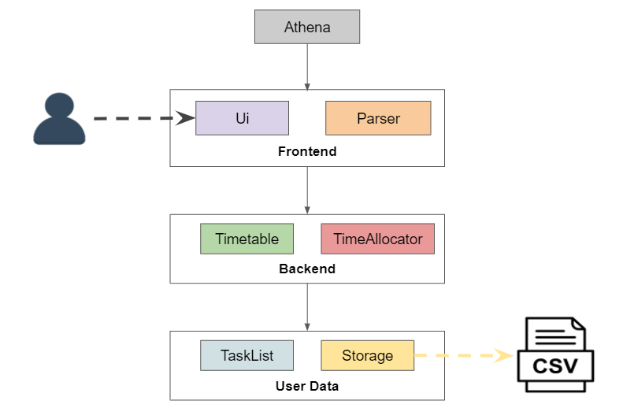
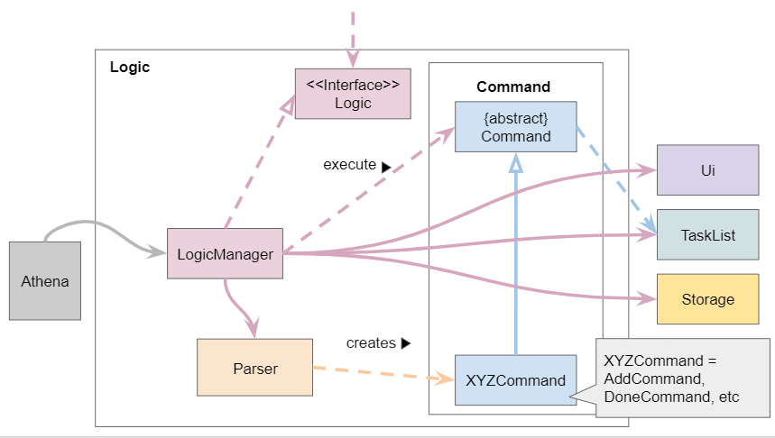
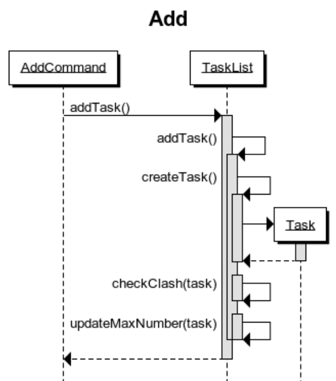
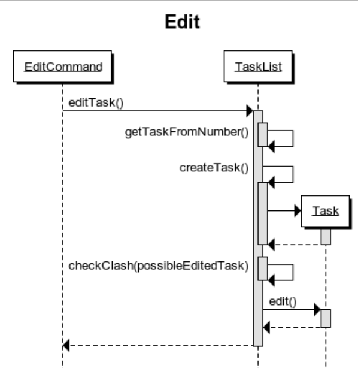

# Developer Guide

- [Introduction](#introduction)
- [Setting up and getting started](#setting-up-and-getting-started)
    - [Prerequisites](#prerequisites)
    - [Setting up the project in your computer](#setting-up-the-project-in-your-computer)
- [Design & implementation](#design--implementation)
    - [Architecture](#architecture)  
    - [UI component](#ui-component)  
    - [Logic component](#logic-component)  
    - [TaskList component](#tasklist-component)  
    - [Storage component](#storage-component)
- [Other Guides](#other-guides-documentation-logging-testing-configuration-dev-ops)    
- [Implementation](#implementation)  
    - [Add task feature](#add-task-feature)
    - [Delete task feature](#delete-task-feature)
    - [Mark task as done feature](#mark-task-as-done-feature)
    - [Edit task feature](#edit-task-feature)
    - [View task feature](#view-task-feature)
    - [Time allocation to task in timetable](#time-allocation-to-task-in-timetable)
    - [Data Storage](#data-storage)
- [Appendix: Requirements ](#appendix-requirements)
    - [Product scope](#product-scope)
        - [Target user profile](#target-user-profile)
        - [Value proposition](#value-proposition)
    - [User stories](#user-stories)
    - [Non-functional requirements](#non-functional-requirements) 
    - [Glossary](#glossary)
    - [Instruction for manual testing](#instructions-for-manual-testing)

## Introduction

ATHENA aims to help students to automate the process of organising their schedule. After the user inputs pre-allocated time slots for work and relaxation, ATHENA figures out the best timetable based on the user’s needs.

This document describes the software architecture and design for the implementation
of ATHENA. The intended audience of this document is the developers, designers, and
software testers of ATHENA.

## Setting up and getting started

### Prerequisites
1. Ensure you have `JDK 11` installed in your computer.
2. Install IntelliJ IDEA.

### Setting up the project in your computer
1. Fork this repository, and clone the fork to your computer.
2. Open Intellij (if you are not in the welcome screen, click `File` > `Close Project` to close the existing project dialog first).
3. Set up the correct JDK version for Gradle  
   1. Click `Configure` > `Project Defaults` > `Project Structure`.
   2. Click `New…` and select the directory where you installed `JDK 11`.
   3. Click `OK`.
4. IntelliJ IDEA by default has the Gradle plugin installed. If you have disabled it, go to `File` > `Settings` > `Plugins` to re-enable them.
   If your project involves GUI programming, similarly ensure the JavaFX plugin has not been disabled.
5. Click `Import Project`(or `Open or Import` in newer version of Intellij).
6. Locate the `build.gradle` file and select it. Click `OK`. If asked, choose to `Open as Project` (not `Open as File`).
7. Click `OK` to accept the default settings if prompted. 
8. Wait for the importing process to finish, and you are good to go!
9. Verify the setup:
    1. Run `Athena` and try a few commands such as `list` or `help`.
    2. Run the JUnit tests to ensure they all pass.

## **Design & implementation**

### Architecture

The ***Architecture Diagram*** given above explains the high-level design of the ATHENA. Given below is a quick overview of each component.

**`Main`** has one class called [`Athena`](https://github.com/AY2021S1-CS2113T-W12-2/tp/blob/master/src/main/java/athena/Athena.java). It is responsible for,
* At app launch: Initializes the components and connects them up with each other.
* At app shut down: Shuts down the components.

The rest of the App consists of these components.

* [**`Ui`**](#athenaUi-component): The UI of ATHENA.
* [**`Logic`**](#logic-component): Parses user input and command executor.
* [**`TaskList`**](#tasklist-component): The list that stores the user's tasks.
* [**`Storage`**](#storage-component): Reads data from, and writes data to, the hard disk.

**How the architecture components interact with each other**

The *Sequence Diagram* below shows how the components interact with each other for the scenario where the user issues the command `delete 1`.

*work in progress*

The sections below give more details of each component.

### UI component

**API** :
[`Ui.java`](https://github.com/AY2021S1-CS2113T-W12-2/tp/blob/master/src/main/java/athena/Ui.java)

The User Interface (UI) seen by the user consists of two main parts: `AthenaUi` and `ColorText`. `AthenaUi` implements the interface `Ui`. `AthenaUi` outputs all the output messages that the user sees after launching the application while `ColorText` applies relevant colours to certain output strings.

As UI outputs the front end viewed by the user, it also prints out error messages tied to exceptions that get thrown to the main `Athena` class. Additionally, since `LogicManager` executes user commands, it requires `AthenaUi`.

### Logic component

**API** :
[`Logic.java`](https://github.com/AY2021S1-CS2113T-W12-2/tp/blob/master/src/main/java/athena/logic/Logic.java)

1. `Logic` uses the `Parser` class to parse the user command.
1. This results in a `Command` object which is executed by the `LogicManager`.
1. The command execution can affect the `TaskList` (e.g. adding a task).
1. The result of the command execution will also call the `Ui` to print the respective messages for each command.

Given below is the Sequence Diagram for interactions within the `Logic` component for the `execute("delete 1")` API call.

*work in progress* 

### TaskList component

**API** :
[`TaskList.java`](https://github.com/AY2021S1-CS2113T-W12-2/tp/blob/master/src/main/java/athena/TaskList.java)

1. The `TaskList` stores task data in `Task` type objects.
2. The `TaskList` is updated in `Athena`.
3. A new `Task` object is created everytime the user uses the command `add`.

### Storage component

**API** : 
[`Storage.java`](https://github.com/AY2021S1-CS2113T-W12-2/tp/blob/master/src/main/java/athena/Storage.java)

--------------------------------------------------------------------------------------------------------------------

## **Other Guides: Documentation, logging, testing, configuration, dev-ops**

This section contains links to other relevant guides.

* [Documentation guide](./Documentation.md)
* [Testing guide](./Testing.md)
* [DevOps guide](./DevOps.md)

-----------------------------------------------------------------------------------------------------------------------

## **Implementation**

This section describes some noteworthy details on how certain features are implemented.

### Add task feature
The adding of task mechanism is facilitated by `LogicManager`.

The retrieving of task details is done by `Parser`. It splits the user input based on the command type and the various parameters' description.
The user can input the parameters in any order.
The `AddCommand` class will then be executed and the task will be added to the `TaskList`.

`Parser`, `AddCommand`, `TaskList` implements the following operations:

* `Parser#parse` - Parse user input to retrieve the command type and task details.
* `Parser#parseAddCommand` - Parse user input to retrieve the respective parameters' details and creates an `AddCommand` object.
* `AddCommand#execute` - Add task into `TaskList` and calls `Ui` to print message output.
* `Storage#saveTaskListData` - Writes the current task list into the save file.

Given below is an example usage scenario and how the task adding mechanism behaves at each step.

**Step 1.** The user adds a task to the application, by inputting `add n/Assignment1 t/1100 D/16-09-2020 d/2 r/Today i/high a/Refer to lecture notes`. 

**Step 2.** The input will be read in by the `Athena` class. The input will be passed into `LogicManager` where the `Parser` will parse the user input to get the command type and details which creates an `AddCommand` object.

**Step 3.** The `TaskList` now contains 1 task (Assignment1). The message to show if the task is added successfully is subsequently outputted by the `Ui` class to the user.
 After the command is executed, `LogicManager` calls `Storage#saveTaskListData` to automatically save the tasks in the `TaskList` into the save file.

**Step 4.** Upon completion of execution, `LogicManager` returns a boolean value `false` to `Athena` to allow the continuous run of the program. 

The following sequence diagram illustrates how the task adding operation works:

### Delete task feature
The deleting task mechanism is facilitated by `LogicManager`.

The retrieving of input details is done by `Parser`. It splits the user input based on the command type and the index of task.
The `DeleteCommand` class will then be executed and the task will be removed from the `TaskList`.

`Parser`, `DeleteCommand`, `TaskList` implements the following operations:

* `Parser#parse` - Parse user input to retrieve the command type and index of task.
* `Parser#parseDeleteCommand` - Parse user input to retrieve the index of task to be deleted and creates an `DeleteCommand` object.
* `DeleteCommand#execute` - Remove task into `TaskList` and calls `Ui` to print message output.
* `Storage#saveTaskListData` - Updates the current task list into the save file.

Given below is an example usage scenario and how the deleting task mechanism behaves at each step.

**Step 1.** The user deletes a task from the application, by inputting `delete 1`. 

**Step 2.** The input will be read in by the `Athena` class. The input will be passed into `LogicManager` where the `Parser` will parse the user input to get the command type and details which creates an `DeleteCommand` object.

**Step 3.** The `TaskList` now removed task with index 1. The message to show if the task is deleted successfully is subsequently outputted by the `Ui` class to the user.
 After the command is executed, `LogicManager` calls `Storage#saveTaskListData` to automatically save the tasks in the `TaskList` into the save file.

**Step 4.** Upon completion of execution, `LogicManager` returns a boolean value `false` to `Athena` to allow the continuous run of the program. 

The following sequence diagram illustrates how the task deleting operation works:

*work in progress*

### Mark task as done feature
The marking task as done mechanism is facilitated by `LogicManager`.

The retrieving of input details is done by `Parser`. It splits the user input based on the command type and the index of task.
The `DoneCommand` class will then be executed and the task will be marked as done in the `TaskList`.

`Parser`, `DoneCommand`, `TaskList` implements the following operations:

* `Parser#parse` - Parse user input to retrieve the command type and index of task.
* `Parser#parseDoneCommand` - Parse user input to retrieve the index of task to be marked as done and creates an `DoneCommand` object.
* `DoneCommand#execute` - Marks task as done into `TaskList` and calls `Ui` to print message output.
* `Storage#saveTaskListData` - Writes the current task list into the save file.

Given below is an example usage scenario and how the marking task as done mechanism behaves at each step.

**Step 1.** The user marks a task as done in the application, by inputting `done 1`. 

**Step 2.** The input will be read in by the `Athena` class. The input will be passed into `LogicManager` where the `Parser` will parse the user input to get the command type and details which creates an `DoneCommand` object.

**Step 3.** The `TaskList` now has task with index 1 marked as done. The message to show if the task is marked as done successfully is subsequently outputted by the `Ui` class to the user.
 After the command is executed, `LogicManager` calls `Storage#saveTaskListData` to automatically save the tasks in the `TaskList` into the save file.

**Step 4.** Upon completion of execution, `LogicManager` returns a boolean value `false` to `Athena` to allow the continuous run of the program. 

The following sequence diagram illustrates how the marking task as done operation works:

*work in progress*

### Edit task feature
The adding of task mechanism is facilitated by `LogicManager`.

The retrieving of task details is done by `Parser`. It splits the user input based on the command type and the various parameters' description.
The user can input the parameters in any order.
The `EditCommand` class will then be executed and the edited task details will be added to the `TaskList`.

`Parser`, `EditCommand`, `TaskList` implements the following operations:

* `Parser#parse` - Parse user input to retrieve the command type, task index and details.
* `Parser#parseEditCommand` - Parse user input to retrieve the respective parameters' details and creates an `EditCommand` object.
* `EditCommand#execute` - Edits the specified task in `TaskList` and calls `Ui` to print message output.
* `Storage#saveTaskListData` - Writes the current task list into the save file.

Given below is an example usage scenario and how the editing task mechanism behaves at each step.

**Step 1.** The user edits a task to the application, by inputting `edit 1 n/Assignment2 t/1100 D/16-09-2020`. 

**Step 2.** The input will be read in by the `Athena` class. The input will be passed into `LogicManager` where the `Parser` will parse the user input to get the command type and details which creates an `EditCommand` object.

**Step 3.** The `TaskList` now has task with index 1 name changed from "Assignment1" to "Assignment2". The message to show if the task is edited successfully is subsequently outputted by the `Ui` class to the user.
 After the command is executed, `LogicManager` calls `Storage#saveTaskListData` to automatically save the edited task details in the `TaskList` into the save file.

**Step 4.** Upon completion of execution, `LogicManager` returns a boolean value `false` to `Athena` to allow the continuous run of the program. 

The following sequence diagram illustrates how the editing task operation works:

### View task feature
The viewing task mechanism is facilitated by `LogicManager`.

The retrieving of input details is done by `Parser`. It splits the user input based on the command type and the index of task.
The `ViewCommand` class will then be executed and the details of that specific task from the `TaskList` will be shown.

`Parser`, `ViewCommand`, `TaskList` implements the following operations:

* `Parser#parse` - Parse user input to retrieve the command type and index of task.
* `Parser#parseViewCommand` - Parse user input to retrieve the index of task to be viewed and creates an `ViewCommand` object.
* `ViewCommand#execute` - Retrieve task details from `TaskList` and calls `Ui` to print task details output.

Given below is an example usage scenario and how the viewing task mechanism behaves at each step.

**Step 1.** The user views a task from the application, by inputting `view 1`. 

**Step 2.** The input will be read in by the `Athena` class. The input will be passed into `LogicManager` where the `Parser` will parse the user input to get the command type and details which creates an `ViewCommand` object.

**Step 3.** The `TaskList` now retrieve details of 1 task (Assignment 1). The message to show if the task details is subsequently outputted by the `Ui` class to the user.

**Step 4.** Upon completion of execution, `LogicManager` returns a boolean value `false` to `Athena` to allow the continuous run of the program. 

The following sequence diagram illustrates how the viewing task operation works:

*work in progress*

### Time allocation to task in timetable
The time allocation mechanism is facilitated by `TimeAllocator`. It allocates time slots to `Task`s in a `TaskList` that are not assigned a fixed time slot by the user. It implements the following operations:

* Work in progress hehe

Implementation
TimeAllocator takes in  TaskList and separates it into a fixedTaskList and a flexibleTaskList

When runAllocate is executed, a ForecastFilter is created in order to separate the tasks based on their days in order to identify the day that they belong to.

An ArrayList named dayLog is used to keep track of the times that the tasks take up during the day, it stores the taskNumber that occupies each of the hourly slots.

Fixed tasks are placed into the dayLog first as they do not change. 

The start time and sleep time is referenced together with the dayLog to identify the vacant slots.

bestLog identifies the tasks from the flexibleTaskList that reduces the dead space in the logs based on changing the tasks available for getLog to insert into the logs.

getLog iterates through the TaskList provided to it and checks if there is enough space in the log for the task before slotting it in. Once it runs out of valid tasks or if the log is fully filled, it returns the log and modifies the provided TaskList to contain the leftover tasks

The process repeats until the dayLog contains no valid positions for tasks in the flexibleTaskList.

The taskNumber is then used to identify what task to modify. It changes the startTime of this task to the first index it is identified at which corresponds to the hour that it started at.

It then modifies the ForecastFilter to identify the tasks on the next day.

Once runAllocate finishes running, it changes the startTime of tasks that have been allocated without altering the isFlexible attribute of the tasks.

Given below is an example usage scenario and how the allocation mechanism behaves at each step.

**Step 1**. The user launches the application. The *data.csv* file located next to the application jar file contains 5 tasks. These tasks are loaded into the `TaskList`. 3 of them have a fixed time slot, while the other 2 are not assigned any time slot.

**Step 2.** The user executes `list` to get an overview of the week. The user sees the 3 tasks with a fixed time slot in the printed timetable.

**Step 3**. The user executes `allocate` to let the application allocate time slots to `Task`s without a fixed time slot.

`TimeAllocator` iterates through the `TaskList`, and checks whether a `Task` has a fixed time slot or should be allocated by the application to an empty slot. Tasks that have a fixed slot are added to a `fixedTaskList`, while the rest are added to a `flexibleTaskList`. The `Task`s in the `flexibleTaskList` are sorted based on their `importance` and `deadline`. Finally, the `TimeAllocator` iterates through the `fixedTaskList` to find empty time slots in a day, which is then allocated to the `Task`s in the sorted `flexibleTaskList`.

The following sequence diagram illustrates how the allocate operation works:

*Work in progress*

**Step 4.** The user executes `list` to get an overview of the week. The user sees all 5 tasks in the printed timetable.

### Data storage
The storage mechanism is facilitated by `Storage`. It reads and writes the `Task`s in a `TaskList` to `data.csv`, a csv file located next to the application jar file.
It implements the following operations:

* `Storage#saveTaskListData` - Writes the current tasks into the save file.
* `Storage#loadTaskListData` - Loads the tasks in the save file into the application.

These operations are called by the `LogicManager`.

Given below is an example usage scenario and how the storage mechanism behaves at each step.

**Step 1.** The user launches the application for the first time. The `TaskList` is initialized to be empty. At this time, there is no *data.csv* file present. So, when `Storage` calls `Storage#loadTaskListData`, this is detected and an empty *data.csv* file is created next to the jar file. Since there was no save file, the `TaskList` remains empty.

**Step 2.** The user adds a task to the application, by executing `add n/Assignment1 t/1100 D/16-09-2020 d/2 r/Today i/high a/Refer to lecture notes`. The `TaskList` now contains 1 task (Assignment 1). After the command is executed, `LogicManager` calls `Storage#saveTaskListData` to automatically save the tasks in the `TaskList` into the save file.

**Step 3.** The user closes the application. Nothing happens since the data in the `TaskList` is already saved.

**Step 4.** The user launches the application again. The `TaskList` is initialized to be empty. `Storage#loadTaskListData` will read from `data.csv` and add the tasks inside the file into the empty `TaskList`. The `TaskList` now contains the task added earlier (Assignment 1) in **step 3**.

**Step 5.** The user executes `list` to get an overview of the week. The user sees *Assignment 1* in the printed timetable.

-----------------------------------------------------------------------------------------------------------------------

## Appendix: Requirements

## Product scope
### Target user profile
* is a university student
* has a need to manage a significant number of tasks
* can type fast and prefers typing to mouse interactions
* is comfortable using the command line interface

#### Value proposition
* ATHENA helps students to automate the process of organising their schedule. After the user inputs pre-allocated time slots for work and relaxation, ATHENA figures out the best theoretical timetable based on the user’s needs.
* It can be updated anytime during the week.
* ATHENA helps to reduce the amount of time and effort that users need to spend planning their time by finding free spaces to slot tasks in, with the goal of reducing dead space in the user’s timetable. 
* The planner will also make sure the user has enough time to eat, exercise and sleep. The user can set up ATHENA to follow a fixed weekly routine, and only needs to update a task list. ATHENA will then plan the timetable based on the importance and deadlines of the tasks in the list, making sure that the user is able to finish everything on time.

### User Stories

| Version | As a ...          | I want to ...                                  | So that I ...                                     |
| ------- | ----------------- | ---------------------------------------------- | ------------------------------------------------- |
| `v1.0`  | forgetful student | upload my tasks for the week                   | remember to do them                               |
| `v1.0`  | student           | mark my tasks as done                          | know that I have done them and can put them aside |
| `v1.0`  | student           | get reminded to do the tasks that are due soon | will be on time                                   |
| `v1.0`  | student           | edit the tasks I added                         | update accordingly to small changes               |
| `v1.0`  | student           | delete the tasks I added                       | remove tasks that are not needed to do anymore    |
| `v1.0`  | student           | set my task according to importance            | complete the more important tasks first           |
| `v1.0`  | student           | leave some notes for a task                    | remember about it                                 |
| `v2.0`  | student           | have a planner that tells me what time to rest | don’t exhaust myself                              |
| `v2.0`  | student           | see an overview of the week ahead              | make sure that I am staying on top of my tasks    |
| `v2.0`  | busy student      | know what tasks to work on next                | don’t need to spend time planning                 |

### Non-Functional Requirements

1.  Should work on any _mainstream OS_ as long as it has Java `11` installed.
2.  A user with above average typing speed for regular English text should be able to use the features of ATHENA faster using commands than using the mouse.

### Glossary

* **Mainstream OS**: Windows, Linux, Unix, OS-X

### Instructions for manual testing

Given below are instructions to test the app manually.

#### Launch and shutdown

1. Initial launch

   1. Download the jar file and copy into an empty folder

   2. Double-click the jar file. Expected: Shows the command line interface with welcome message.

2. Shutdown ATHENA

   1. Test case: `exit` 
      Expected: A farewell message by ATHENA will be shown.   
    
#### Adding a task

Adding a task to the list.

1. Test case: `add n/Assignment1 t/1100 D/16-09-2020 d/2 r/Today i/high a/Refer to lecture notes` 
   Expected: First task is added to the list. Details of the added task is shown.

2. Test case: `add t/1100 D/16-09-2020` 
   Expected: No task is added. Error details is shown.
      
#### Deleting a task

Deleting a task while all tasks are shown.

1. Prerequisites: List all tasks using the `list` command.

2. Test case: `delete 1` 
   Expected: Task with index 1 is deleted from the list. Details of the deleted task is shown.

3. Test case: `delete -1` 
   Expected: No task is deleted. Error details is shown.

4. Other incorrect delete commands to try: `delete`, `delete x` (where x is larger than the list size) 
   Expected: Similar to previous.
 
#### Marking a task as done

Marking a task as done while all tasks are shown.

1. Prerequisites: List all tasks using the `list` command.

2. Test case: `done 1` 
   Expected: Task with index 1 is marked as done in the list. Details of the task is shown.

3. Test case: `done -1` 
   Expected: No task is marked as done. Error details is shown.

4. Other incorrect delete commands to try: `done`, `done x` (where x is larger than the list size) 
      Expected: Similar to previous.
      
#### Viewing the full details of a task

Viewing a task details while all tasks are shown.

1. Prerequisites: List all tasks using the `list` command.

2. Test case: `view 1` 
   Expected: Details of the task with index 1 in the list is shown.

3. Test case: `view -1` 
   Expected: No task details is shown. Error details is shown.

4. Other incorrect delete commands to try: `view`, `view x` (where x is larger than the list size) 
   Expected: Similar to previous.

#### Editing a task

Editing a task details while all tasks are shown.

1. Prerequisites: List all tasks using the `list` command.

2. Test case: `edit 1 n/new name` 
   Expected: Name of the task with index 1 in the list will be changed to `new name`.

3. Test case: `edit -1` 
   Expected: No task will be edited. Error details is shown.

4. Other incorrect delete commands to try: `edit`, `edit x` (where x is larger than the list size) 
   Expected: Similar to previous.

#### Listing all tasks

Listing all the tasks with or without filters.

1. Test case: `list` 
   Expected: All the tasks will be listed.

2. Test case: `list i/HIGH f/TODAY` 
   Expected: All the tasks today with high importance will be shown.
      
#### Help

Guide on the use of ATHENA.

1. Test case: `help` 
   Expected: A guide on how to use ATHENA will be shown.

#### Data storage

Storage of user data (e.g. tasks).

1. Dealing with corrupted data files

   1. Open data.csv located next to Athena.jar.

   2. Test case (If the file is not empty): Add `,aaaa` at the end of the first line.

      Expected: The task on that line is corrupted. When you launch Athena again, it will fail to start, while providing an error message to the user.

   3. Test case (If the file is not empty): Remove a comma (`,`) from the file.

      Expected: The task on that line is corrupted. When you launch Athena again, it will fail to start, while providing an error message to the user.

   4. Test case: Add `aaaaa` at the end of the file.

      Expected: An invalid task is added. When you launch Athena again, it will fail to start, while providing an error message to the user.
