# User Guide

- [Introduction](#introduction)
- [Quick Start](#quick-start)
- [Features](#features)
    - [View Help](#view-help-help)
    - [Add a task](#add-a-task-add-or-a)  
    - [List tasks](#list-tasks-list-or-l)  
    - [Edit task](#edit-task-edit-or-e)  
    - [Mark task as done](#mark-task-as-done-done-or-dn)  
    - [Delete task](#delete-task-delete-or-dl)
    - [View task](#view-task-view-or-v)
    - [Exit](#exit-program-exit-or-ex)
    - [Saving the data](#saving-the-data)
- [FAQ](#faq)    
- [Command Summary](#command-summary)  

## Introduction

Welcome and thank you for choosing ATHENA! ATHENA is your Automated Timetable Helper Encourager n' Assistant and is a desktop daily life planner optimized for use via a Command Line Interface (CLI).

ATHENA uses algorithmic optimisation to give you the best timetable that allows you to make the most of your time. With ATHENA, you can save time on planning your timetable and be more efficient with your time.

You can take a look at the table of contents above if you are looking for a specific command, or you can begin by looking at the **[Quick Start](#quick-start)** section below.

We hope you enjoy using ATHENA and start being more productive today!

## Quick Start

1. Ensure that you have **Java 11** or above installed.
2. Download the latest version of **ATHENA** [here](https://github.com/AY2021S1-CS2113T-W12-2/tp/releases).
3. Copy the downloaded Athena.jar into your **Desktop**.
4. Open the terminal/command prompt and enter `cd Desktop`.
5. Then, enter `java -jar Athena.jar`.
6. A welcome message as seen below will be shown:

*SCREENSHOT*

If you are new to the command line and require a guide: 
* Click [here](https://www.minitool.com/lib/cmd.html) if you use Windows
* Click [here](https://flaviocopes.com/cli-for-beginners/) if you use Mac
 

## Features 
Notes about the command format:
* Words in UPPER_CASE are the parameters to be supplied by the user.
e.g. in `add n/NAME`, NAME is a parameter which the user provides, such as: `add n/Assignment1`.
* Parameters can be in any order.
e.g. if the command specifies `n/NAME t/TIME`, `t/TIME n/NAME` is also acceptable.
* Any unknown parameter type entered by the user that does not fit the parameters accepted in a respective feature will be ignored.
e.g `add n/NAME p/PARAMETER`, since `p/` is an unknown parameter type for `add` command, `p/PARAMETER` is ignored.
* If user types in 2 or more parameter description for each parameter type, only the first description will be taken.
e.g. if user types `n/NAME1 n/NAME2`, only `NAME1` will be recorded as the task's name.
* Items in square brackets are optional. e.g in `n/NAME  [d/DURATION]`, the parameters can be provided as `n/Task1 d/1` or as `n/Task1`.
(Refer to the Intermediate Usage section of each command for more information)
* For some commands, if no parameters are specified, the command will execute using the default values for each parameter.
* For dates, the program follows the **DD-MM-YYYY** format.
* For time, the program follows the **HHMM** format.

### View Help: `help`
Prints out a message on how to use ATHENA.

#### Format: `help`

#### Expected output

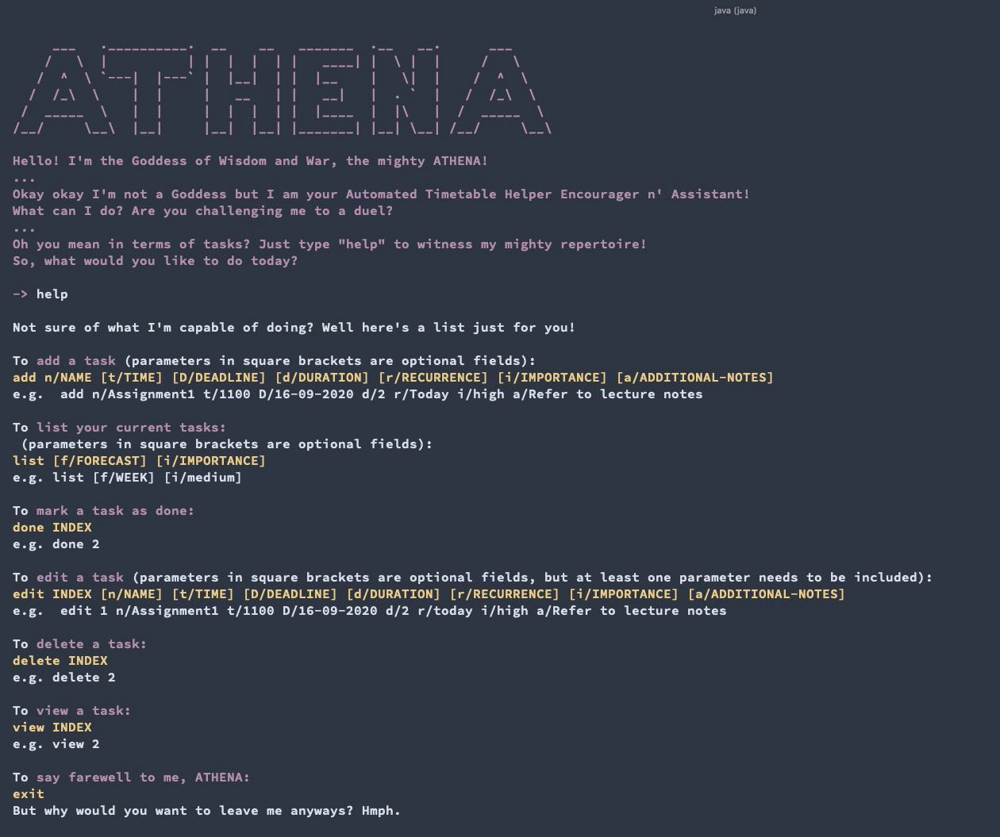

### Add a task: `add` or `a`
This command adds a task to the timetable.

The guide for this command is split into three sections:

* [Basic Usage (add)](#basic-usage-add) (For users new to command line applications)
* [Intermediate Usage (add)](#intermediate-usage-add) (For users comfortable with command line applications)
* [Advanced Usage (add)](#advanced-usage-add) (Extension of *Intermediate Usage (add)*)

#### Basic Usage (add)

In this section, for easier understanding, the `add` command will make use of all parameters.
Users new to command line applications should find it easy to use as long as they follow the descriptions in the sections below. 
Users who are comfortable with the basic usage may move on to the [Intermediate](#intermediate-usage-add) and [Advanced](#advanced-usage-add) stages to experience how ATHENA was intended to be used.

##### Command Format

`add n/NAME t/TIME d/DURATION D/DEADLINE r/RECURRENCE i/IMPORTANCE a/ADDITIONAL-NOTES`

##### Parameters
The `add` command accepts 7 parameters.

* `NAME` is the name of the task.

* `TIME` is the time to start doing this task (**HHMM**). For example, 1100.

* `DURATION` is the expected time taken to complete task (in hours). For example, 2.

* `DEADLINE` is the date to complete the task by (**DD-MM-YYYY**). For example, 16-11-2020.

* `RECURRENCE` is one of **TODAY**, **MONDAY**, **TUESDAY**, **WEDNESDAY**, **THURSDAY**, **FRIDAY**, **SATURDAY**, **SUNDAY** or a specific date (**DD-MM-YYYY**).

   This is where the user can input a specific date to do the task on.
   If the input provided is not **TODAY** or a specific date (**DD-MM-YYYY**), the program will treat the task as occuring every week. For example, **MONDAY** means the task happens every Monday.
   
* `IMPORTANCE` is one of **HIGH**, **MEDIUM**, **LOW**.

* `ADDITIONAL-NOTES` are the additional notes of the task.

##### Example Usage

The following shows the output from ATHENA after entering `add n/Assignment1 t/1100 D/16-11-2020 d/2 r/Today i/high a/Refer to lecture notes`.
You should expect to see a message which confirms that the task has been added.

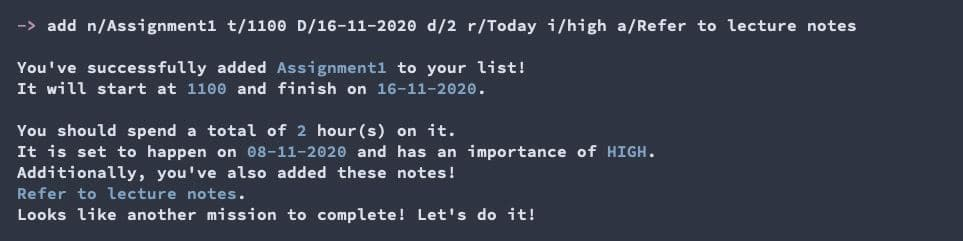

#### Intermediate Usage (add)

In this section, square brackets around parameters indicate that they optional. e.g `n/NAME  [d/DURATION]` can be used as `n/Task1 d/1` or as `n/Task1`.
Users comfortable with command line applications can proceed with the Intermediate usage as detailed in the sections below and can operate ATHENA as it was intended to be used.

##### Command Format

`add n/NAME [t/TIME] [d/DURATION] [D/DEADLINE] [r/RECURRENCE] [i/IMPORTANCE] [a/ADDITIONAL-NOTES]`

##### Parameters
The `add` command accepts 7 parameters:

* `NAME` is the name of the task. It is a compulsory parameter the user has to include.

* `TIME` is the time to start doing this task (**HHMM**). For example, 1100.

   Default: Allocated by Athena (only available for non-recurring tasks)
   
   | :exclamation: This parameter is optional only if the task is non-recurring. Otherwise, the user must specify a start time for the task.|
   |------------------------------------------------------------------------------------------------------------------------------------------------------------------------|

The following parameters are optional. If they are left empty, ATHENA will use the default value assigned.
* `DURATION` is the expected time taken to complete task (in hours). For example, 2.

   Default: 1 hour.
* `DEADLINE` is the date to complete the task by (**DD-MM-YYYY**). For example, 16-11-2020.

   Default: No deadline.
* `RECURRENCE` is one of **TODAY**, **MONDAY**, **TUESDAY**, **WEDNESDAY**, **THURSDAY**, **FRIDAY**, **SATURDAY**, **SUNDAY** or a specific date (**DD-MM-YYYY**).

   This is where the user can input a specific date to do the task on. 
   If the input provided is not **TODAY** or a specific date (**DD-MM-YYYY**), the program will treat the task as occurring every week. For example, **MONDAY** means the task happens every Monday.
   
   Default: **TODAY**.
* `IMPORTANCE` is one of **HIGH**, **MEDIUM**, **LOW**.

   Default: **MEDIUM**.
* `ADDITIONAL-NOTES` are the additional notes of the task.

   Default: No notes.

##### Example Usage

The screenshot below shows the output from ATHENA after entering `add n/Assignment2 t/1400 i/high`.
You should expect to see a message to confirm that the task has been added, with some of the parameters having their default value assigned.

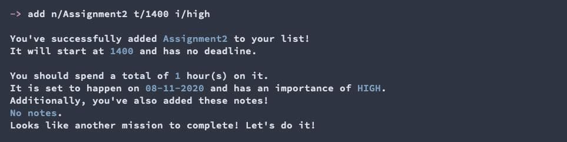

#### Advanced Usage (add)

This section is an extension of the [Intermediate Usage (add)](#intermediate-usage-add) section.

The `add` command supports shortcuts catered for advanced users.

##### Supported Shortcuts

The command on the left in the table below is the shortcut of the corresponding command on the right.

| Shortcut | Expanded command |
|----------|------------------|
| `a`     | `add`  |

##### Example usage

You can just type `a` instead of `add`.
The screenshot below shows the output from ATHENA after entering `a n/Assignment3 t/1900 D/16-11-2020 d/2 a/Refer to notes`.
You should expect to see a message to confirm that the task is added with some of the parameter's default value assigned.

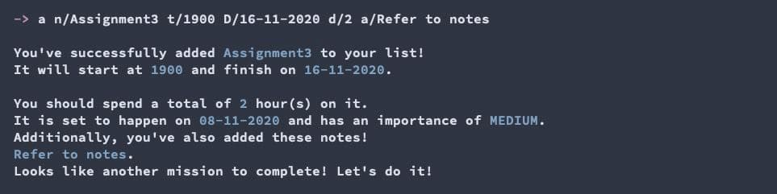

### List tasks: `list` or `l`

This command shows your tasks organized nicely in a timetable.
Each task will be printed with a number (the task ID) that is used as an identifier for other commands (e.g. `edit`, `done`, `delete`), as shown in the screenshot below.

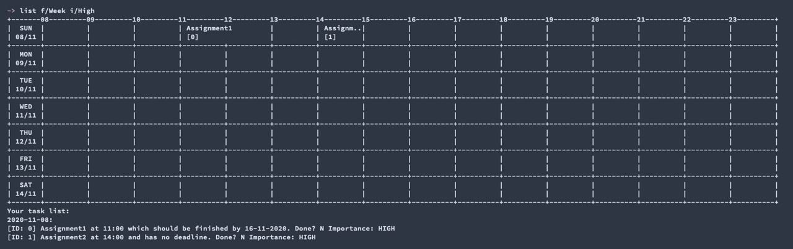

| :bulb:  If the timetable is too big to fit in the screen, consider using a smaller font size in your terminal/command prompt, or stretch your window to full width. If you're unsure how to adjust font size, check out [this link](https://www.isunshare.com/windows-10/change-font-and-font-size-in-windows-10-command-prompt.html) for Windows users and [this link](https://osxdaily.com/2015/01/11/increase-text-size-terminal-app-mac-keystrokes/) for Mac users.  |
|-----------------------------------------------------------------------------------------------------------------------------------------------------------------------|

The guide for this command is split into three sections:

* [Basic Usage (list)](#basic-usage-list) (For users new to command line applications)
* [Intermediate Usage (list)](#intermediate-usage-list) (For users comfortable with command line applications)
* [Advanced Usage (list)](#advanced-usage-list) (Extension of *Intermediate Usage*)

#### Basic Usage (list)

In this section, for easier understanding, the `list` command will make use of all parameters.
Users new to command line applications should find it easy to use as long as they follow the descriptions in the sections below. 
Users who are comfortable with the basic usage may move on to the [Intermediate](#intermediate-usage-list) and [Advanced](#advanced-usage-list) stages to experience how ATHENA was intended to be used.

The `list` command accepts 2 parameters.
You can indicate in your command to filter your tasks based on

* the range of days you want to see
* the importance of the tasks

##### Command Format

`list f/FORECAST i/IMPORTANCE`

* `FORECAST`: **DAY** to show the tasks occurring today, **WEEK** to show the tasks occurring in the week ahead, and **ALL** to show all your upcoming tasks.

* `IMPORTANCE`: One of **HIGH**, **MEDIUM**, **LOW**, or  **ALL**.

##### Example Usage

The following shows the output from ATHENA after entering `list f/Week i/High`.
You should expect to see all **high importance tasks** occuring **in the week ahead**, as shown in the screenshot below.

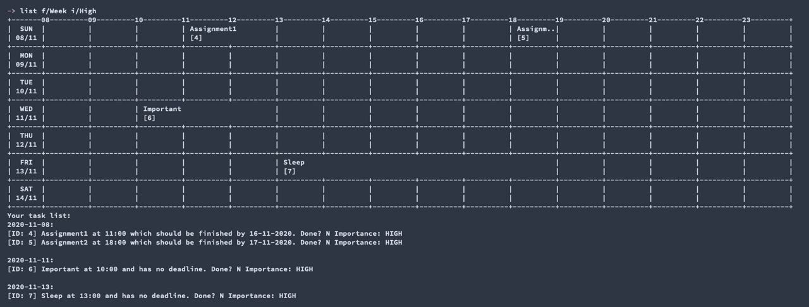

#### Intermediate Usage (list)

The `list` command accepts 2 parameters.
You can tell the command to filter your tasks based on

* the range of days you want to see
* the importance of the tasks

In this section, the two parameters listed above are optional. If they are left empty, ATHENA will use the default value assigned.

##### Command Format

`list [f/FORECAST] [i/IMPORTANCE]`

* `FORECAST`: **DAY** to show the tasks occurring today, **WEEK** to show the tasks occurring in the week ahead, and **ALL** to show all your upcoming tasks.

  Default: **WEEK**.

* `IMPORTANCE`: One of **HIGH**, **MEDIUM**, **LOW**, **ALL**.

  Default: **ALL**.

##### Example Usage

The following shows the output from ATHENA after entering `list f/Week i/High`.
You should expect to see all **high importance tasks** occuring **in the week ahead**.

Alternatively, you can let ATHENA use the default values for the parameters.
For example, entering `list i/Low` will show all **low importance** tasks occuring **in the week ahead**, as shown in the screenshot below.

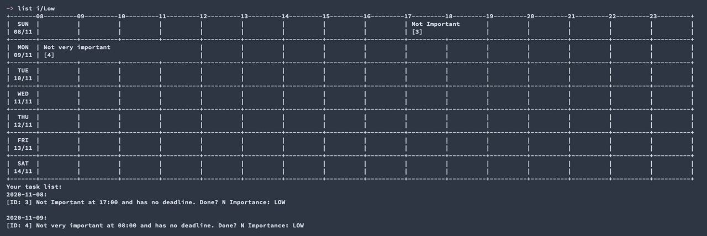

#### Advanced Usage (list)

This section is an extension to the [Intermediate Usage (list)](#intermediate-usage-list) section.

The `list` command supports shortcuts catered for advanced users.

##### Supported Shortcuts

The commands on the left in the table below are the shortcuts of the corresponding commands on the right.

| Shortcut | Expanded command |
|----------|------------------|
| `l3`     | `list i/HIGH`    |
| `l2`     | `list i/MEDIUM`  |
| `l1`     | `list i/LOW`     |
| `lw`     | `list f/WEEK`    |
| `ld`     | `list f/DAY`     |
| `la`     | `list f/ALL`     |

##### Example usage

The following are all valid commands.

* `l`
* `ld`
* `list f/WEEK i/medium`
* `l2 f/WEEK`

You can enter `l2 f/DAY` to list **medium importance** tasks occuring **today**, as shown in the screenshot below.

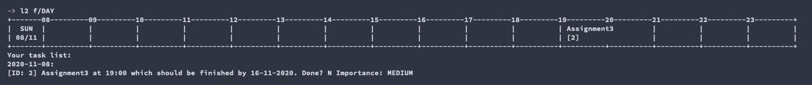

### Edit task: `edit` or `e`
This command edits a specific task in the timetable.

The guide for this command is split into two sections:

* [Basic Usage (edit)](#basic-usage-edit) (For users new to command line applications)
* [Intermediate Usage (edit)](#intermediate-usage-edit) (For users comfortable with command line applications)

| :exclamation:  Keep in mind that you cannot edit the details of a task if the date of the task has passed. For example, if a task has occured yesterday, you cannot edit the details of that task.|
|------------------------------------------------------------------------------------------------------------------------------------------------------------------------|

#### Basic Usage (edit)

In this section, users new to command line applications should find it easy to use as long as they follow the descriptions in the sections below.
Square brackets around parameters indicate that they are optional. e.g `TASK-ID [n/NAME] [d/DURATION]` can be used as `1 n/Task1 d/1` or as `1 n/Task1`.

##### Command Format

`edit TASK-ID [n/NAME] [t/TIME] [d/DURATION] [D/DEADLINE] [r/RECURRENCE] [i/IMPORTANCE] [a/ADDITIONAL-NOTES]`

##### Parameters
The `edit` command accepts 8 parameters:

* `TASK-ID` refers to the number shown beside the task that the user wants to edit in the displayed task list. It must be a non-negative integer.

At least one parameter shown below has to be included in the command execution:
* `NAME` is the name of the task.

* `TIME` is the time to start doing this task (**HHMM**). For example, 1100.

| :exclamation:  Keep in mind that you cannot edit the time of a task if the task was initially added without a specified time. |
|------------------------------------------------------------------------------------------------------------------------------------------------------------------------|

* `DURATION` is the expected time taken to complete task (in hours). For example, 2.

* `DEADLINE` is the date to do task by (**DD-MM-YYYY**). For example, 16-11-2020.

* `RECURRENCE` is one of **TODAY**, **MONDAY**, **TUESDAY**, **WEDNESDAY**, **THURSDAY**, **FRIDAY**, **SATURDAY**, **SUNDAY** or a specific date (**DD-MM-YYYY**).

* `IMPORTANCE` is one of **HIGH**, **MEDIUM**, **LOW**.

* `ADDITIONAL-NOTES` are the additional notes of the task.

##### Example Usage

Firstly, use the [list command](#list-tasks-list-or-l) to view the `TASK-ID` of the task to be edited.

The screenshot below shows the output from ATHENA after entering `edit 1 t/1800`.
You should expect to see a message to confirm that the time of task with `TASK-ID` '1' is edited.

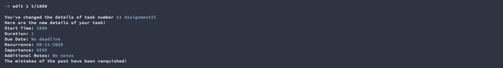

#### Intermediate Usage (edit)

The `edit` command supports shortcuts for advanced users.

##### Supported Shortcuts

The command on the left in the table below is the shortcut of the corresponding command on the right.

| Shortcut | Expanded command |
|----------|------------------|
| `e`     | `edit`  |

##### Example usage

Firstly, use the [list command](#list-tasks-list-or-l) to get the `TASK-ID` of the task to be edited.

The user can just type `e` instead of `edit`.
The screenshot below shows the output from ATHENA after entering `e 1 n/Assignment2 t/1800 D/17-11-2020 d/1 r/today i/high a/Refer to lecture notes`.
You should expect to see a message to confirm that the time of task with `TASK-ID` '1' is edited.

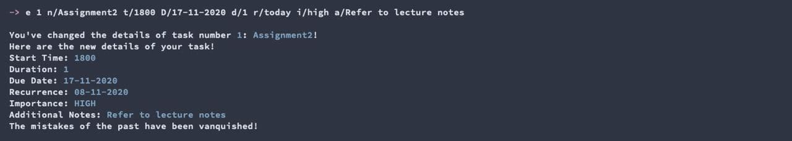

### Mark task as done: `done` or `dn`
This command marks the specified task from the timetable as done.

The guide for this command is split into two sections:
* [Basic Usage (done)](#basic-usage-done) (For users new to command line applications)
* [Intermediate Usage (done)](#intermediate-usage-done) (For users comfortable with command line applications)

#### Basic Usage (done)
In this section, users new to command line applications should find it easy to use as long as they follow the descriptions in the sections below. 
Users who are comfortable with the basic usage may move on to the [Intermediate](#intermediate-usage-done) stage to experience how ATHENA was intended to be used.

##### Command Format

`done TASK-ID`

##### Parameters
The `done` cmmand requires 1 parameter only.

* `TASK-ID` refers to the number shown beside the task that the user wants to mark as done in the displayed task list. It must be a non-negative integer.

##### Example Usage

Firstly, use the [list command](#list-tasks-list-or-l) to get the `TASK-ID` of the task that you want to mark as done.
The screenshot below shows the output from ATHENA after entering `done 0`.
You should expect to see a message to confirm that the task with `TASK-ID` of `0` is marked as done. 

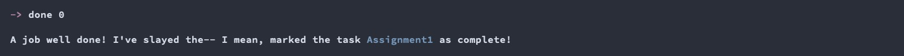

#### Intermediate Usage (done)
The `done` command supports shortcuts for intermediate users.

##### Supported Shortcuts

The command on the left in the table below is the shortcut of the corresponding command on the right.

| Shortcut | Expanded command |
|----------|------------------|
| `dn`     | `done`  |

##### Example usage

Firstly, use the [list command](#list-tasks-list-or-l) to get the `TASK-ID` of the task to be marked as done.

The user can just type `dn` instead of `done`.
The screenshot below shows the output from ATHENA after entering `dn 1`.

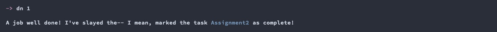
